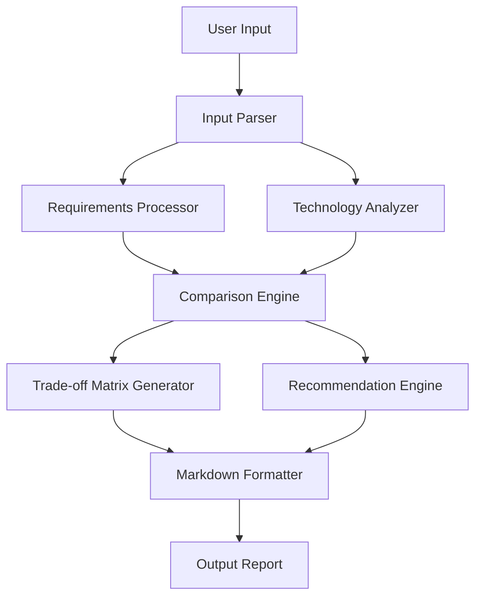

# Design Document: The Referee

## Overview

The Referee is a command-line tool that generates structured technology comparison reports. It takes user project requirements and technology options as input, then produces comprehensive Markdown-formatted comparisons featuring side-by-side analysis, trade-off matrices, and tailored recommendations.

The system follows a modular architecture with clear separation between input processing, analysis logic, and output formatting. This design ensures maintainability while supporting extensible comparison criteria and output formats.

## Architecture



The architecture consists of five main components:

1. **Input Processing Layer**: Parses user requirements and technology specifications
2. **Analysis Layer**: Processes technology characteristics and user constraints  
3. **Comparison Engine**: Generates structured comparisons and evaluates trade-offs
4. **Recommendation Engine**: Provides weighted recommendations based on requirements
5. **Output Layer**: Formats results into scannable Markdown reports

## Components and Interfaces

### Input Parser
Handles command-line arguments and configuration files to extract:
- Technology stacks to compare (2-5 options)
- Project requirements (team size, budget, timeline, scalability needs)
- Custom comparison dimensions
- Output preferences

**Interface:**
```
parseInput(args: string[]): ComparisonRequest
validateTechnologies(techs: string[]): ValidationResult
```

### Requirements Processor  
Analyzes project constraints and converts them into weighted criteria:
- Maps budget constraints to cost sensitivity weights
- Translates timeline pressure to complexity/learning curve weights
- Converts scalability needs to performance dimension weights
- Processes team expertise levels for technology familiarity scoring

**Interface:**
```
processRequirements(requirements: ProjectRequirements): WeightedCriteria
calculateWeights(constraints: Constraints): DimensionWeights
```

### Technology Analyzer
Maintains a knowledge base of technology characteristics and evaluates each option across standard dimensions:
- **Cost**: Licensing, infrastructure, operational expenses
- **Scalability**: Horizontal/vertical scaling capabilities, performance limits
- **Complexity**: Learning curve, implementation difficulty, maintenance overhead
- **Ecosystem**: Community support, library availability, tooling maturity
- **Performance**: Speed, resource efficiency, throughput capabilities

**Interface:**
```
analyzeTechnology(tech: string): TechnologyProfile
evaluateDimension(tech: string, dimension: string): DimensionScore
getKnowledgeBase(): TechnologyKnowledgeBase
```

### Comparison Engine
Orchestrates the comparison process by combining technology profiles with weighted requirements:
- Generates side-by-side comparisons with pros/cons analysis
- Creates trade-off matrices with dimensional scoring
- Identifies key differentiators between options
- Calculates overall compatibility scores

**Interface:**
```
generateComparison(techs: TechnologyProfile[], weights: WeightedCriteria): ComparisonResult
createTradeoffMatrix(techs: TechnologyProfile[], dimensions: string[]): TradeoffMatrix
calculateCompatibility(tech: TechnologyProfile, requirements: WeightedCriteria): CompatibilityScore
```

### Recommendation Engine
Provides intelligent recommendations based on weighted analysis:
- Ranks technologies by compatibility with project requirements
- Identifies clear winners and close matches
- Explains reasoning behind recommendations
- Highlights key decision factors and potential risks

**Interface:**
```
generateRecommendation(comparison: ComparisonResult): Recommendation
explainReasoning(recommendation: Recommendation): ReasoningExplanation
identifyDecisionFactors(comparison: ComparisonResult): DecisionFactor[]
```

### Markdown Formatter
Converts analysis results into highly scannable Markdown output:
- Formats side-by-side comparisons using tables with clear headers
- Creates trade-off matrices with aligned columns and consistent spacing
- Applies bullet points and visual hierarchy for pros/cons sections
- Ensures compatibility with standard Markdown renderers

**Interface:**
```
formatComparison(comparison: ComparisonResult): string
formatTradeoffMatrix(matrix: TradeoffMatrix): string
formatRecommendation(recommendation: Recommendation): string
```

## Data Models

### ComparisonRequest
```
{
  technologies: string[],           // 2-5 technology names
  projectRequirements: {
    teamSize: number,
    budget: BudgetLevel,           // LOW, MEDIUM, HIGH
    timeline: TimelineLevel,       // TIGHT, MODERATE, FLEXIBLE  
    scalabilityNeeds: ScaleLevel,  // SMALL, MEDIUM, LARGE
    expertiseLevel: ExpertiseLevel // BEGINNER, INTERMEDIATE, EXPERT
  },
  customDimensions?: string[],     // Optional additional comparison criteria
  outputPreferences: {
    includeMatrix: boolean,
    includeRecommendation: boolean,
    maxTechnologies: number
  }
}
```

### TechnologyProfile
```
{
  name: string,
  category: string,              // API, Database, Cloud Service, Framework
  dimensions: {
    cost: DimensionScore,        // Numerical score with explanation
    scalability: DimensionScore,
    complexity: DimensionScore,
    ecosystem: DimensionScore,
    performance: DimensionScore
  },
  pros: string[],               // Specific advantages
  cons: string[],               // Specific disadvantages  
  bestFor: string[],            // Ideal use cases
  metadata: {
    maturity: MaturityLevel,    // EXPERIMENTAL, STABLE, MATURE
    license: string,
    maintainer: string
  }
}
```

### TradeoffMatrix
```
{
  technologies: string[],
  dimensions: string[],
  scores: number[][],           // 2D array: [tech_index][dimension_index]
  explanations: string[][],     // Reasoning for each score
  highlights: {                 // Key differentiators
    dimension: string,
    leader: string,
    explanation: string
  }[]
}
```

### Recommendation
```
{
  rankedChoices: {
    technology: string,
    score: number,
    confidence: ConfidenceLevel,  // LOW, MEDIUM, HIGH
    reasoning: string
  }[],
  keyDecisionFactors: string[],
  caveats: string[],
  alternativeScenarios?: {       // When requirements change
    scenario: string,
    recommendedTech: string,
    explanation: string
  }[]
}
```

## Correctness Properties

*A property is a characteristic or behavior that should hold true across all valid executions of a system-essentially, a formal statement about what the system should do. Properties serve as the bridge between human-readable specifications and machine-verifiable correctness guarantees.*

### Property Reflection

After analyzing all acceptance criteria, several properties can be consolidated to eliminate redundancy:

- Properties 2.1, 2.2, and 2.3 (pros, cons, best-for sections) can be combined into a single comprehensive structure validation property
- Properties 5.2, 5.3, 5.4, and 5.5 (various Markdown formatting requirements) can be consolidated into a comprehensive Markdown format compliance property  
- Properties 4.3, 4.4, and 4.5 (requirement-specific emphasis) can be combined into a single requirements-weighting property

### Core Properties

**Property 1: Comparison Report Generation**
*For any* valid set of 2-5 technology stacks, the system should generate a complete comparison report containing all required sections
**Validates: Requirements 1.1, 1.4**

**Property 2: Required Section Structure**  
*For any* generated comparison report, each technology should have dedicated Pros, Cons, and Best For sections with non-empty content
**Validates: Requirements 2.1, 2.2, 2.3**

**Property 3: Trade-off Matrix Inclusion**
*For any* comparison report, a trade-off matrix should be included with standard dimensions (cost, scalability, complexity, learning curve, maintenance) represented
**Validates: Requirements 3.1, 3.2**

**Property 4: Consistent Rating Scale**
*For any* trade-off matrix, all dimension scores should use the same rating scale format throughout the matrix
**Validates: Requirements 3.3**

**Property 5: Requirements-Based Weighting**
*For any* two identical technology comparisons with different project requirements, the analysis emphasis and scores should differ based on the requirements provided
**Validates: Requirements 4.2, 4.3, 4.4, 4.5**

**Property 6: Input Validation**
*For any* project requirements input containing team size, budget, timeline, scalability needs, and expertise level, the system should accept and process all fields without errors
**Validates: Requirements 4.1**

**Property 7: Custom Dimension Support**
*For any* comparison request with custom dimensions specified, those dimensions should appear in the trade-off matrix alongside standard dimensions
**Validates: Requirements 3.5**

**Property 8: Requirement Highlighting**
*For any* project requirements that emphasize specific constraints (budget, timeline, scalability), the corresponding dimensions should be highlighted or weighted more heavily in the analysis
**Validates: Requirements 3.4**

**Property 9: Markdown Format Compliance**
*For any* generated report, the output should be valid Markdown syntax that renders correctly in standard Markdown parsers
**Validates: Requirements 5.1, 5.6**

**Property 10: Structured Markdown Formatting**
*For any* comparison report, side-by-side comparisons should use tables with clear headers, trade-off matrices should have technologies as rows and dimensions as columns, and pros/cons should use consistent bullet point formatting
**Validates: Requirements 5.2, 5.3, 5.4, 5.5**

**Property 11: Recommendation Inclusion**
*For any* complete comparison analysis, a "Recommended Choice" section should be included with reasoning based on the provided project requirements
**Validates: Requirements 6.1, 6.2**

**Property 12: Decision Factor Highlighting**
*For any* comparison where multiple technologies have similar overall scores (within 10% of each other), key deciding factors should be explicitly highlighted in the recommendation
**Validates: Requirements 6.3**

**Property 13: Clear Preference Communication**
*For any* comparison where one technology scores significantly higher (>25% difference) than others, the recommendation should clearly state this preference with explicit reasoning
**Validates: Requirements 6.4**

**Property 14: Confidence Indication**
*For any* recommendation generated with limited technology data or uncertain analysis, confidence levels or appropriate caveats should be included
**Validates: Requirements 6.5**

## Error Handling

The system implements comprehensive error handling across all components:

### Input Validation Errors
- **Invalid Technology Count**: Reject requests with <2 or >5 technologies with clear error messages
- **Unknown Technologies**: Provide suggestions for similar known technologies when unrecognized options are provided
- **Malformed Requirements**: Validate all requirement fields and provide specific guidance for corrections
- **Invalid Custom Dimensions**: Ensure custom dimensions don't conflict with standard dimension names

### Analysis Errors  
- **Insufficient Technology Data**: Gracefully handle cases where technology profiles are incomplete, marking affected dimensions as "Limited Data Available"
- **Conflicting Requirements**: Detect and warn when project requirements are contradictory (e.g., "low budget" + "enterprise scalability")
- **Calculation Failures**: Implement fallback scoring when weighted calculations fail, using unweighted averages

### Output Generation Errors
- **Markdown Rendering Issues**: Validate generated Markdown syntax before output and escape problematic characters
- **Table Formatting Failures**: Ensure table alignment and structure remain valid even with varying content lengths
- **Missing Content**: Detect and handle cases where required sections cannot be generated, providing placeholder content with explanations

### Recovery Strategies
- **Partial Analysis**: When some technologies cannot be fully analyzed, generate partial comparisons with clear limitations noted
- **Fallback Recommendations**: If weighted analysis fails, provide unweighted comparisons with appropriate disclaimers
- **Graceful Degradation**: Continue processing even when non-critical features (like custom dimensions) encounter errors

## Testing Strategy

The testing approach combines unit tests for specific functionality with property-based tests for comprehensive validation across diverse inputs.

### Unit Testing Focus
Unit tests validate specific examples, edge cases, and integration points:

- **Technology Recognition**: Test that known technologies (REST, GraphQL, AWS Lambda, EC2) are correctly identified and categorized
- **Requirements Processing**: Verify that specific requirement combinations produce expected weight calculations
- **Markdown Generation**: Test that specific comparison scenarios generate properly formatted Markdown tables
- **Error Conditions**: Validate error handling for invalid inputs, missing data, and edge cases
- **Integration Points**: Test component interactions and data flow between analysis and formatting layers

### Property-Based Testing Configuration
Property-based tests use **fast-check** library for JavaScript/TypeScript with minimum 100 iterations per test:

- **Input Generation**: Create random but valid technology combinations, project requirements, and custom dimensions
- **Structure Validation**: Verify that all generated reports maintain consistent structure regardless of input
- **Format Compliance**: Test Markdown validity across diverse content variations
- **Scoring Consistency**: Ensure that similar inputs produce similar scores and that requirement changes affect scores predictably
- **Recommendation Logic**: Validate that recommendations align with calculated scores and provided reasoning

### Test Organization
```
tests/
├── unit/
│   ├── input-parser.test.ts
│   ├── technology-analyzer.test.ts  
│   ├── comparison-engine.test.ts
│   ├── recommendation-engine.test.ts
│   └── markdown-formatter.test.ts
├── properties/
│   ├── comparison-generation.property.test.ts
│   ├── structure-validation.property.test.ts
│   ├── markdown-compliance.property.test.ts
│   └── requirements-weighting.property.test.ts
└── integration/
    ├── end-to-end.test.ts
    └── cli-interface.test.ts
```

Each property test includes a comment tag referencing its design document property:
```typescript
// Feature: the-referee, Property 1: For any valid set of 2-5 technology stacks, the system should generate a complete comparison report
```

### Coverage Requirements
- **Unit Tests**: Achieve >90% code coverage for individual components
- **Property Tests**: Validate all 14 correctness properties with comprehensive input generation
- **Integration Tests**: Test complete workflows from CLI input to Markdown output
- **Performance Tests**: Ensure analysis completes within reasonable time limits (<5 seconds for typical comparisons)